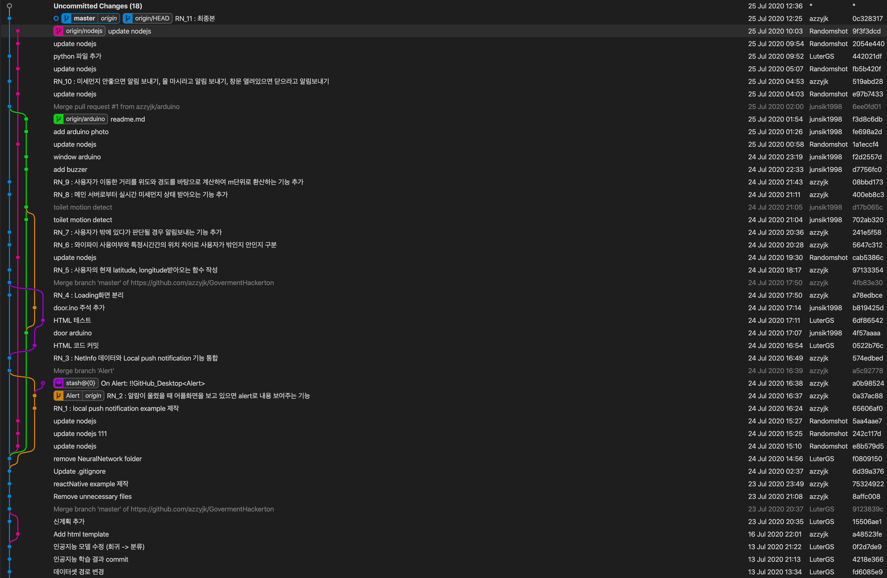
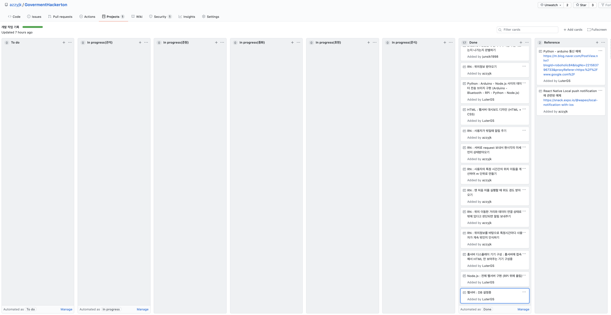

# 미세먼지 생활수칙 준수를 위한 홈 IoT

## Team : APDO

이관석, 방준식, 이호현, 정준원, 정종화

## 목차

1. 프로젝트 소개
1. 제안 이유
1. 개발환경
1. 구현 내용
1. 기대 효과
1. 제작 과정

## 프로젝트 소개

> - 4차 산업혁명의 화두 중 하나인 초연결 시대를 IoT 홈네트워크로 구현함과 동시에 미세먼지 생활 수칙을 사람이 일일히 신경쓰지 않고도 알려주는 자동화 서비스이다.
> - 해당 서비스가 상용화된다면 더 많은 사람이 더 적은 비용으로 미세먼지 재해를 예방할 수 있음과 동시에 초연결을 경험할 수 있을 것이다.

---

## 제안 이유

> - 4차 산업혁명의 주요 소재 중 하나인 IoT는 여러 문제로 인해 많이 활성화되지 않은 추세이다.
> - 아직 많은 사람들의 IoT 활용은 스마트스피커와 휴대폰으로 국한되어 있다. 또한, 최근 몇년간 미세먼지로 인한 대기오염 문제가 재해로 규정될 정도로 심각해지고 있는 상황임에도 불구하고, 미세먼지 생활수칙을 제대로 숙지하고 있는 사람들이 적으며, 보통은 미세먼지를 신경쓰는 사람들 중 일부만 실외 이동시에 마스크를 착용하고 있는 상황이다.
> - 이 두가지 문제를 종합해, 미세먼지 생활수칙을 준수할 수 있는 홈 IoT 서비스를 구성하게 되었다.

---

## 개발환경

### IOT

#### 하드웨어

1. 라즈베리파이 4 (Raspbian 10)
1. 아두이노
   - 초음파센서
   - 움직임 감지센서
   - 소형 디스플레이 (Android Device)

#### 소프트웨어

1. Node.js
1. Python
1. C++
1. Linux
   - SSH
1. MySQL

### App

1. React-Native

   - expo-notification
   - @react-native-community/netinfo
   - expo-permissions
   - expo-location

1. expo

### 공공 데이터

1. 실시간 미세먼지데이터
1. 미세먼지 행동수칙 정보

### 프로젝트 관리

1. GIT
   

1. khanban
   

---

## 구현 내용

### 1. 미세먼지가 높을 때 장시간 실외활동 자제 알림

    미세먼지 농도가 높은 날에, 장시간 실외에 있다고 판단되면 (30분동안 100m이상을 이동했고, 계속 셀룰러데이터(LTE/3G등)상태일 때) 휴대폰으로 실내로 들어가라는 권고 알림을 보내준다.

### 2. 외출시 날씨에 따른 필요품 추천 : 사용자가 집을 나갈 때, 현관문에 설치된 디스플레이에 현재 날씨에 따른 권고를 보낸다.

    (1). 미세먼지 농도가 높을 때 : 마스크를 착용하라는 권고를 디스플레이에 표시한다.
    (2). 비가 오는 날일 때 : 우산을 챙기라는 권고를 디스플레이에 표시한다.
    (3). + 차량번호 등록 - 대중교통 이용

### 3. 외출후 손, 얼굴 씻도록 권고

    외출에서 돌아온 후, 지정된 시간 (30초/1분)을 내로 화장실로 가지 않으면, 화장실에 설치된 IoT기기에서 버저음이 울림으로써 손을 씻도록 강조한다.

### 4. 충분한 수분섭취 권고

    한 시간에 한번씩, 휴대폰으로 물을 마시라는 권고 알림을 보내준다.

### 5. 창문을 닫아 외부의 미세먼지 유입을 차단하도록 권고

    현재 날씨와 창문의 열림/닫힘 상태를 통해 창문의 열림/닫힘을 권고한다.
    (1). 미세먼지 농도가 높고 창문이 열려있을 때 : 휴대폰으로 창문을 닫으라는 권고 알림을 보낸다.
    (2). 비가 오고 창문이 열려있을 때 : 휴대폰으로 창문을 닫으라는 권고 알림을 보낸다.
    (3). 창문을 닫은 지 n시간이 경과했을 때 : 휴대폰으로 창문을 열으라는 권고 알림을 보낸다.

---

## 기대 효과

### 1. 미세먼지 생활수칙 준수율 증가

    미세먼지 생활수칙을 의식하면서 준수하기는 쉽지 않지만, 각종 IoT시스템을 이용해서 사용자에게 의식적으로 준수하게끔 해 준다면, 생활수칙의 준수율이 유의미한 수치까지 올라가리라 기대할 수 있다.

### 2. 미세먼지 재해 관련/비관련 질병률 하락

    미세먼지 생활수칙을 준수함에 따라, 기본 위생수준이 올라가고, 따라서 미세먼지 관련 질병 및 기타 위생관련 질병을 예방할 수 있다. 대표적인 예로, 손씻기를 준수하게 되면 단순 미세먼지로 일어나는 호흡기질환뿐 아니라 세균관련 질병을 예방할 수 있다.

### 3. 생활수준 향상

    홈 IoT 서비스가 단순 미세먼지 예방수칙 준수뿐만 아니라, 날씨에 따른 준비물 추천 등의 기본적인 서비스도 제공하기 때문에, 전반적인 삶의 질을 향상시켜주리라 기대할 수 있다.

## 제작 과정

### IOT

1. 홈서버 (라즈베리파이 사용) 구축

   - 라즈베리파이가 메인 서버이고, 메인 서버에 Node.js를 이용해 상시실행 웹서버를 만든다.

2. 아두이노 세트를 필요한 장소 (현관문, 화장실, 창틀)에 설치하고, 필요한 동작 방식을 아두이노에 업로드한다

3. 각 아두이노와 라즈베리 파이가 통신 가능하게끔 설정한다.

### App

1. Local Push Notification 구현
1. NetInfo, Location을 이용해 사용자가 밖인지 안인지 구별
1. 홈서버와 통신해 다음의 정보 받아오기
   - 실시간 미세먼지 상태
   - 창문의 오픈 여부
